# Second Spin — thrift blind box storefront

A six-page marketing and storefront site for a sustainable fashion startup selling
**thrift blind boxes**: curated mystery boxes of rescued secondhand clothing, 5–6
garments per box, with an interactive odds wheel.

No build step, no dependencies, no network calls. Open `index.html` in a browser, or
serve the folder:

```bash
python3 -m http.server 8099     # then visit http://localhost:8099
```

Serving over HTTP is preferable to `file://` so that `localStorage` (the cart) behaves
normally.

---

## Pages

| File | Purpose |
|---|---|
| `index.html` | Homepage — hero, live impact counter, how-it-works, playable wheel, tier teaser, testimonials |
| `shop.html` | All three tiers side by side, wheel with tier switcher, full comparison table |
| `box.html` | Product page with the full wheel interaction. Accepts `?tier=starter\|classic\|premium` |
| `impact.html` | "Why it matters" — textile waste crisis, cited sources, measurement methodology, sustainability-score method |
| `cards.html` | Card Vault — the collectibles line, with the reveal reel. Accepts `?tier=bulk\|collector\|vault` |
| `lookbook.html` | All 200 catalogue garments as pixel art, filterable by rarity tag and garment category. Accepts `?tag=rare` |
| `faq.html` | Odds & fairness, sourcing, sizing, shipping, returns policy for blind items |
| `about.html` | Origin story, timeline, the team, five public commitments |

`box.html` is a single template driven by the `?tier=` query string rather than three
near-identical files. The tier switcher rewrites the URL via `history.replaceState`, so
any tier is linkable.

---

## Architecture

```
index.html  shop.html  box.html  impact.html  faq.html  about.html
assets/
  css/
    styles.css     design tokens, base, components (buttons, cards, wheel, modal, cart, tables)
    pages.css      page-level compositions (hero, tiers, timeline, FAQ, impact, journey)
  js/
    site-data.js   ← single source of truth: rarities, tier odds, impact figures, helpers
    app.js         nav, scroll reveal, impact counter, odds modal, cart, marquee, forms
    wheel.js       the Wheel class + tier switcher + product-page data binding
tests/
  interaction-test.html    37 in-browser assertions (see Verification)
  screenshot-harness.html  scrolls a page to a selector for section screenshots
```

### One source of truth for the odds

Every published percentage on the site is derived at runtime from the `TIERS` table in
`assets/js/site-data.js`. The wheel geometry, the odds bars, the legends, the odds
modal and the product-page copy all read from that one object, so the playful UI and the
honest disclosure cannot drift apart. `site-data.js` also asserts at load time that each
tier's odds sum to exactly 100% and logs a console error if they don't.

To change the odds, edit `TIERS[].odds` and nothing else.

### Static HTML, duplicated chrome

The header, footer and cart drawer are repeated verbatim in all six files. That is a
deliberate trade to keep the deliverable dependency-free and instantly openable. If you
edit the nav or footer, apply it to all six — or introduce a templating step at that
point.

---

## The wheel, and why it's built this way

The brief asked for a wheel that feels exciting but isn't deceptive. Four rules drive
the implementation in `assets/js/wheel.js`:

1. **Honest geometry.** Segment arcs are computed directly from the odds table, so a 2%
   outcome occupies exactly 2% of the circle. Rare slices are never visually inflated.
   When a slice is too thin for a label, the label is dropped rather than the slice
   widened.
2. **Draw first, animate second.** `drawRarity()` resolves the outcome *before* the
   animation begins; the spin only visualises a decision already made. Nothing about
   the animation's speed or duration can influence the result, and there is no near-miss
   weighting that parks the pointer just past a rare slice.
3. **No stakes.** Spinning is free and unlimited, reserves nothing and buys nothing. The
   UI says so next to every wheel, and the wheel is labelled a simulator, not the draw.
4. **Self-auditing.** After each spin the wheel shows the visitor's observed rate beside
   the published rate, so the maths is checkable on the spot.

Supporting this, the site deliberately omits loot-box mechanics: no countdown timers,
no streak bonuses, no artificial scarcity, and no paid re-roll with a downside (see
[Trade Up](#trade-up) below). `impact.html` also declines
to publish per-box water or CO₂ figures, on the grounds that the conversion factors for
garment reuse vary too widely to state one honestly — and says that out loud rather than
quietly omitting it.

### Odds model

Each box has 1–2 **feature slots** rolled independently against the tier's table; the
remaining pieces are guaranteed everyday staples, not lottery tickets.

| Outcome | Starter $10 | Classic $22 | Premium $45 |
|---|---|---|---|
| Vintage Rare | 2% | 6% | 20% |
| Designer Label | 5% | 12% | 30% |
| Statement Piece | 13% | 22% | 35% |
| Seasonal Pick | 25% | 25% | 15% |
| Everyday Staple | 55% | 35% | never |
| **Feature slots** | 1 | 2 | 2 |
| **Chance of ≥1 standout per box** | 45% | 87.8% | 100% |

"Chance of ≥1 standout" is `1 − (P(everyday))^featureSlots`, computed by
`standoutChancePerBox()` rather than hardcoded. For Classic:
`1 − 0.35² = 87.8%`.

### Trade Up

A paid second chance on a feature slot, built specifically so it is **not** a re-roll.

If a slot lands on Everyday Staple or Seasonal Pick, the customer can pay 10% of the box
price to give that piece back and draw again from a pool with that outcome *and everything
below it* removed. Because the floor is raised, the result **cannot be worse** than what
was given up — it's a guaranteed upgrade, so there is no loss to chase.

| Box | Give up | Draw from | Worst case | Fee |
|---|---|---|---|---|
| Starter | Everyday | Seasonal 58.2% · Statement 30.2% · Designer 11.6% | Seasonal | $1.00 |
| Starter | Seasonal | Statement 72.2% · Designer 27.8% | Statement | $1.00 |
| Classic | Everyday | Seasonal 42.4% · Statement 37.3% · Designer 20.3% | Seasonal | $2.20 |
| Classic | Seasonal | Statement 64.7% · Designer 35.3% | Statement | $2.20 |
| Premium | Seasonal | Statement 53.8% · Designer 46.2% | Statement | $4.50 |

Three constraints, all in `TRADE_UP` in `site-data.js`:

1. **`maxPerSlot: 1`** — hard cap, no escalating pricing. Maximum add-on is 10% per slot.
2. **`eligibleFrom: ['everyday', 'seasonal']`** — only the outcomes that actually
   disappoint. You cannot trade up from a good result to farm a better one.
3. **`protected: ['rare']`** — Vintage Rare is never a Trade Up outcome. It is the
   scarcest stock and it is what Premium's price is built on; selling a $2.20 shortcut
   to it would break the price ladder and drain inventory that Premium boxes are
   promised.

Why this is profitable rather than a giveaway: garments are bought **by the pound**, so
upgrading a slot barely moves COGS — the binding constraint is inventory, not cash. And
the traded-back garment is re-graded into the pool rather than destroyed, so the fee is
earned against near-zero marginal cost. Customer strictly gains, business gains margin,
nothing is wasted.

`site-data.js` asserts at load that every Trade Up pool sums to 100% **and** that its
floor outcome strictly outranks the outcome traded away — if a future edit breaks the
guarantee, the console says so.

Trade Up is offered post-delivery, on the order page, once the customer has handled the
real garment — deliberately not from an animation before the box ships.

### The reveal reel

A horizontal case-opening animation (`assets/js/reel.js`) — a 64-cell strip scrolls past a
centre marker, decelerates over 5.2s, and stops on your result. Available as an alternative
to the wheel on `box.html` via a toggle (the choice persists), and it is the primary reveal
on `cards.html`.

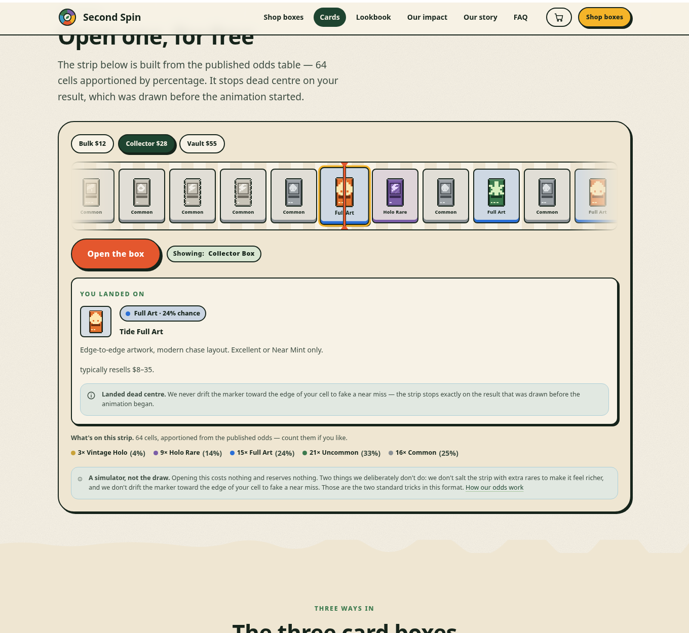

This pattern is borrowed from game case-openers, which are built to manipulate. This one is
built not to, and the two specific tricks it refuses are named on screen:

1. **The strip *is* the odds table.** Cell counts are apportioned from the published
   percentages by largest-remainder, so on a Collector Box the strip holds exactly 3 Vintage
   Holo cells (4%), 9 Holo Rare (14%), 15 Full Art (24%). The UI prints the composition so
   you can count them. **No salting the strip with extra rares** to make it feel richer.
2. **No manufactured near-miss.** Case-openers habitually decelerate so the marker drifts to
   the very edge of your cell with a jackpot sitting just beyond, faking an "so close!"
   that has no basis in the draw. This lands **dead centre, every time** — there is a test
   asserting the drift is under 1.5px (it measures 0.00px).

Plus the same rules as the wheel: outcome drawn *before* the animation starts, neighbours of
the winning cell are whatever the distribution put there rather than arranged for tension,
and the winner is placed by **swapping** cells so the published composition is preserved
exactly rather than injected into.

The reel is product-line agnostic — `reelSource()` resolves either rarity ladder, so the
clothing and card verticals share one implementation.

### Card Vault — the collectibles line

A second product line on the same honest-odds model: blind boxes of authentic secondhand
trading cards, bought as bulk lots and graded by hand. Own rarity ladder, own odds tables,
same 100%-sum assertion (`assets/js/card-data.js`).

| Outcome | Bulk $12 | Collector $28 | Vault $55 |
|---|---|---|---|
| Vintage Holo | 1% | 4% | 14% |
| Holo Rare | 6% | 14% | 30% |
| Full Art | 13% | 24% | 36% |
| Uncommon | 30% | 33% | 20% |
| Common | 50% | 25% | never |
| **Feature slots** | 1 | 2 | 2 |
| **Chance ≥1 beats a Common** | 50% | 93.8% | 100% |

60 card designs generated by `tools/generate-cards.py` (~30 KB total).

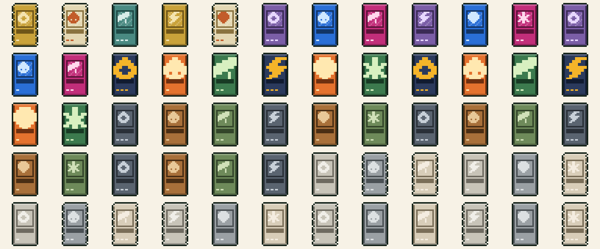

> **Artwork and IP.** Every sprite in `assets/cards/` is an original generic design — frame,
> art window, abstract elemental sigil, holo treatment, stat pips. **No existing franchise's
> characters, logos, typefaces, layouts or trade dress are reproduced, and none should be
> added.** Reselling authentic secondhand cards is lawful under first-sale doctrine and real
> inventory can be described factually in copy; borrowing another company's art for *our own*
> site assets is a different thing entirely. `tools/generate-cards.py` and
> `assets/js/card-data.js` both carry this note at the top so it survives future edits.
>
> Randomised card products also attract more regulatory attention than clothing. `cards.html`
> states an 18+ restriction and the one-box-per-month subscription cap. **Get actual legal
> advice before selling this for real** — some jurisdictions restrict paid randomised
> products, and physical and digital are treated differently.

### Item lookbook — 200 pixel-art garments

"Vintage Rare" is an abstraction until you can see one. `lookbook.html` shows all 200
catalogue garments as pixel art, tagged with the rarity band they belong to, filterable by
tag and by category. Landing on an outcome in the wheel also surfaces a real catalogue
piece, linked through to the filtered lookbook.

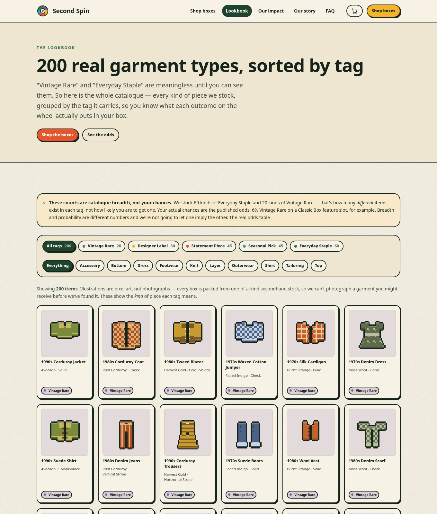

**Catalogue breadth per tag** — 20 Vintage Rare, 30 Designer Label, 45 Statement Piece,
45 Seasonal Pick, 60 Everyday Staple.

> These are **not odds.** Breadth is how many *distinct* items exist under a tag; the
> odds are your chance of drawing one. The page says this in a callout at the top,
> because letting a big "60" imply good chances would be exactly the kind of soft
> deception the rest of the site is built to avoid.

#### How the art is made

There is no image-generation dependency and no binary asset pipeline. Sprites are
generated procedurally by [`tools/generate-assets.py`](tools/generate-assets.py):

```bash
python3 tools/generate-assets.py
```

- **Pure standard library.** The PNG encoder is ~25 lines of `zlib` + `struct` at the
  bottom of the file. No Pillow, no network.
- **32×32 logical grid, written at 4× (128px).** Sprites are authored as rectangles, then
  *auto-outlined* and *auto-shaded*. That is what makes 200 sprites look like one
  coherent set — nobody hand-draws outlines, so nothing drifts stylistically.
- **25 garment silhouettes × 30 colourways × 9 patterns**, combined deterministically from
  a fixed seed, so regenerating produces byte-identical output and the catalogue stays
  stable.
- **Total payload ~85 KB for all 200 sprites** (~436 bytes each). Rendered with
  `image-rendering: pixelated` so they never get smoothed.

Outputs: `assets/items/*.png`, `assets/js/item-catalog.js` (a JS file rather than JSON, so
the site still works from `file://` where `fetch()` of local JSON is blocked), and
`docs/contact-sheet.png` for reviewing the whole set at once.

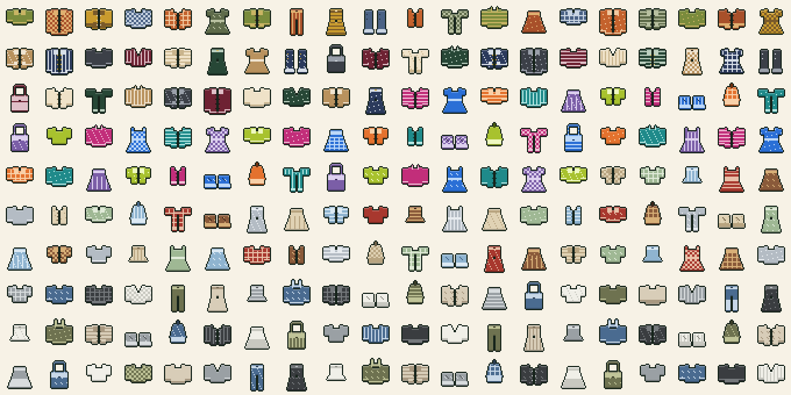

To add garments, add a silhouette builder and register it in `GARMENTS`; to restyle, edit
`PALETTES`. Counts per tag are in `COUNTS`.

### Sustainability score

The badge on each tier is a weighted average of four observable components, published in
full on `impact.html#score`:

| Component | Weight | Starter | Classic | Premium |
|---|---|---|---|---|
| Weight kept in circulation | 40% | 78 | 86 | 94 |
| Condition & remaining life | 25% | 78 | 86 | 96 |
| Packaging & shipping | 20% | 92 | 92 | 92 |
| Swap policy | 15% | 84 | 92 | 96 |
| **Weighted score** | | **82** (B+) | **88** (A−) | **94** (A) |

---

## Design system

Earthy foundation with arcade accents, per the brief's "earthy but fun" direction.

- **Neutrals** — recycled-paper creams (`--paper` `#f7f2e6` → `--paper-3` `#e4d8bf`) with a
  procedural grain overlay generated by an SVG `feTurbulence` filter, so there are no
  image assets to load.
- **Greens** — `--forest` `#1e4430`, `--moss` `#3c7a4e`, `--sage` `#a9c6a2`.
- **Accents** — `--sun` `#f4b429`, `--berry` `#e4572e`, `--grape` `#7b5ea7`, `--sky` `#3e9bc0`.
  These double as the rarity ramp, so a colour means the same thing on the wheel, in a
  chip, in a legend and in a table.
- **Type** — a serif display stack (Iowan/Palatino/Georgia, with Liberation and DejaVu
  fallbacks for Linux) against a system sans for body copy. No webfonts, so no network
  dependency and no layout shift.
- **Motion** — overshoot easing (`--ease-bounce`) on buttons and cards, sticker-style
  offset shadows, torn-paper section dividers via SVG masks, a confetti burst on a rare
  hit. All of it collapses under `prefers-reduced-motion: reduce`, and the wheel resolves
  instantly rather than spinning.

All illustration is inline SVG (hero box, logo, icons, stars, arrows). Glyphs that are
missing from some font stacks — `★ ▾ →` — are drawn as SVG rather than typed, so nothing
renders as tofu.

### Accessibility

Skip link; visible focus rings; semantic landmarks and heading order; `aria-current` on
the active nav item; the FAQ uses native `<details>`/`<summary>`; the odds modal traps
focus, closes on <kbd>Esc</kbd> and restores focus to its trigger; the wheel is a real
`<button>` with results announced through `role="status"`; the canvas carries an
`aria-label` listing the full odds. Every page is readable and navigable with JavaScript
disabled — the odds appear as static text and the complete odds table lives in
`faq.html#odds`.

---

## Verification

`tests/interaction-test.html` drives the real pages in same-origin iframes and asserts
100 behaviours. Run it against a served copy:

```bash
python3 -m http.server 8099 &
chrome --headless --no-sandbox --force-prefers-reduced-motion \
  --virtual-time-budget=45000 --dump-dom \
  "http://localhost:8099/tests/interaction-test.html" | grep -E 'PASS|FAIL|TOTAL'
```

`--force-prefers-reduced-motion` makes spins resolve synchronously, which keeps the
assertions fast and deterministic.

It covers, among other things:

- the wheel paints, and **every segment arc angle equals its published percentage**
  (the load-bearing claim of the whole design)
- segment arcs sum to exactly 360°
- a spin produces a result, states its probability, and updates the running tally
- switching tier rebinds price, odds, standout chance, slot diagram, guarantee, features,
  wheel geometry and the add-to-cart button
- the odds modal opens, sums to 100%, discloses never-occurring outcomes, and closes
- cart add / quantity / totals / diverted-weight display
- `?tier=` deep links
- impact counters, marquee duplication, scroll reveals, newsletter validation

Checks run during development and worth repeating after edits:

```bash
# odds sum to 100, derived percentages, score arithmetic, and a 200k-draw
# sanity check that the RNG actually produces the advertised distribution
node --check assets/js/*.js
```

---

## Prototype boundaries

Things that are intentionally not real, and are labelled as such in the UI:

- **No checkout.** The cart persists to `localStorage`; "Checkout" prints a notice that
  no payment provider is connected.
- **Impact figures are illustrative.** The counter ticks on a timer so it visibly moves.
  In production these read from the packing-bench scale; `IMPACT.liveDrip` exists only
  for the demo and `impact.html#receipts` discloses it.
- **The newsletter form sends nothing.**
- **Email addresses and the monthly odds audit table are placeholders.**

Textile-waste statistics on `impact.html` are **not** placeholders. They are cited and
linked to primary sources:

- [US EPA — Textiles: Material-Specific Data](https://www.epa.gov/facts-and-figures-about-materials-waste-and-recycling/textiles-material-specific-data)
  (11.3 million tons landfilled, 7.7% of MSW landfilled, 2018 figures)
- [NIST — Your Clothes Can Have an Afterlife](https://www.nist.gov/news-events/news/2022/05/your-clothes-can-have-afterlife)
  (~103 lbs / 47 kg discarded per person per year, citing EPA)
- [US EPA — National Overview: Facts and Figures](https://www.epa.gov/facts-and-figures-about-materials-waste-and-recycling/national-overview-facts-and-figures-materials)
  (municipal solid waste series, ~17M tons of textile waste generated annually)

EPA textile reporting lags by several years, so 2018 is the most recent complete data;
the page says so instead of implying the figures are current.

---

## Renaming the brand

"Second Spin" was chosen because it reads as both the wheel mechanic and a garment's
second life. To rebrand:

```bash
# visible text, titles, meta descriptions
sed -i 's/Second Spin/Your Brand/g' *.html assets/js/site-data.js README.md
# placeholder email domain
sed -i 's/secondspin\.example/yourbrand.example/g' *.html
# cart storage key (optional; bumping it clears existing carts)
sed -i "s/secondspin\.cart\.v1/yourbrand.cart.v1/" assets/js/app.js
```

The logo is an inline SVG in the header and footer of each page — a five-segment wheel in
the rarity colours with a leaf at the hub.

---

## Screenshots

Captures live in [`docs/screenshots/`](docs/screenshots) (desktop 1360px, mobile 400px).

### Homepage

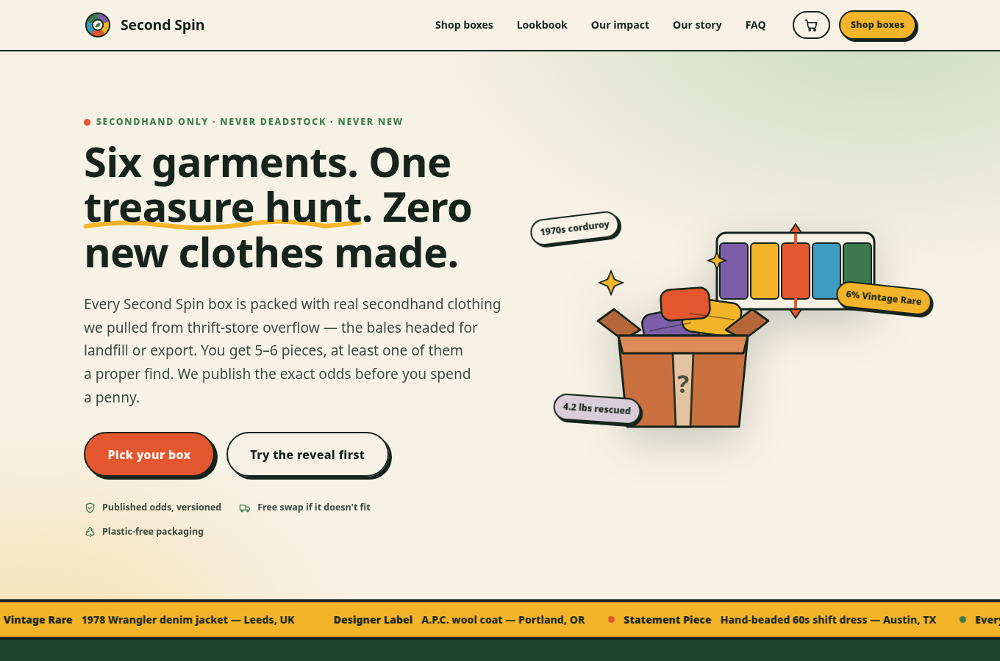

### The wheel

Segment sizes are generated from the odds table, so the 6% Vintage Rare slice really is
a 6% sliver and the 35% Everyday Staple wedge dominates.

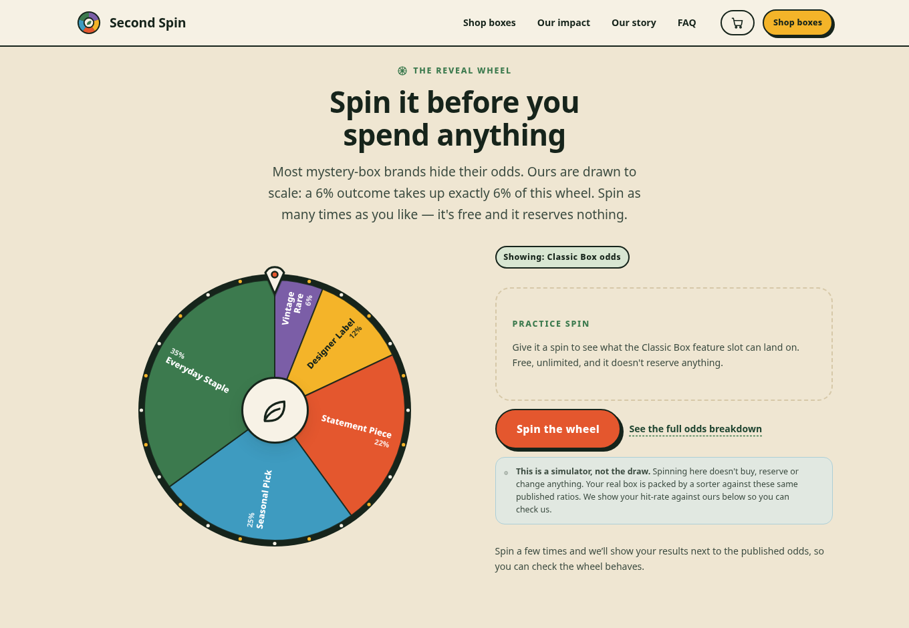

On the Premium tier the wheel has only four segments — the Everyday Staple wedge is
physically absent, which is what "feature slots never land on a basic" means.

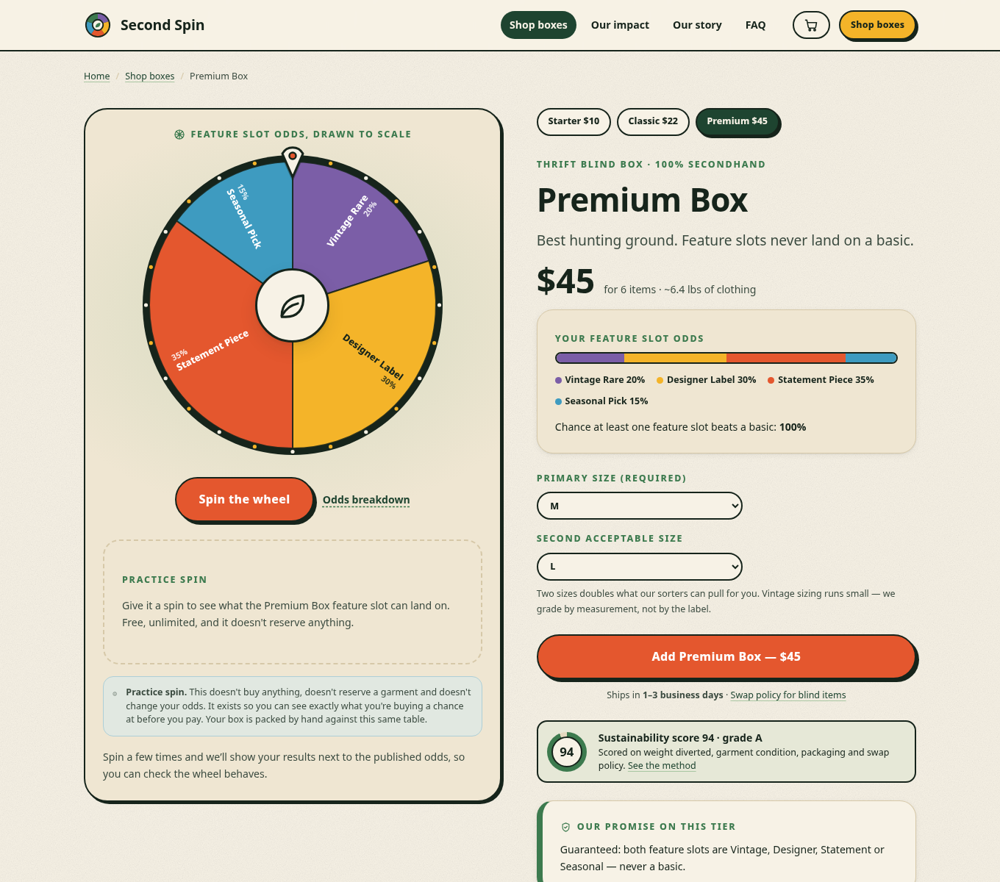

### Trade Up

The offer only appears on an Everyday Staple or Seasonal Pick result. It shows the exact
pool, the floor guarantee, and the fee before anything is committed — and Vintage Rare is
visibly absent from the pool.

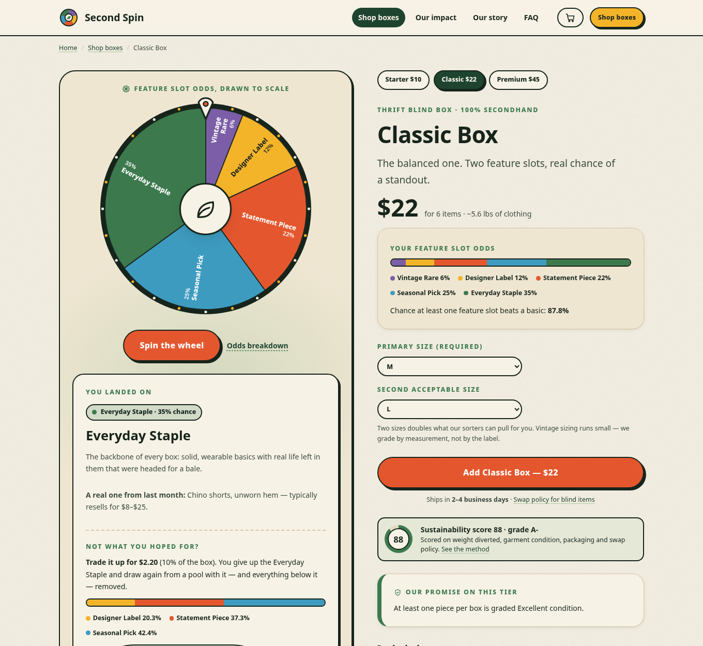

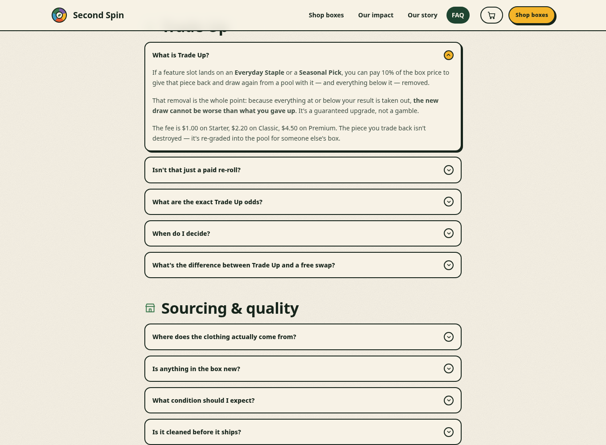

### Tiers and comparison

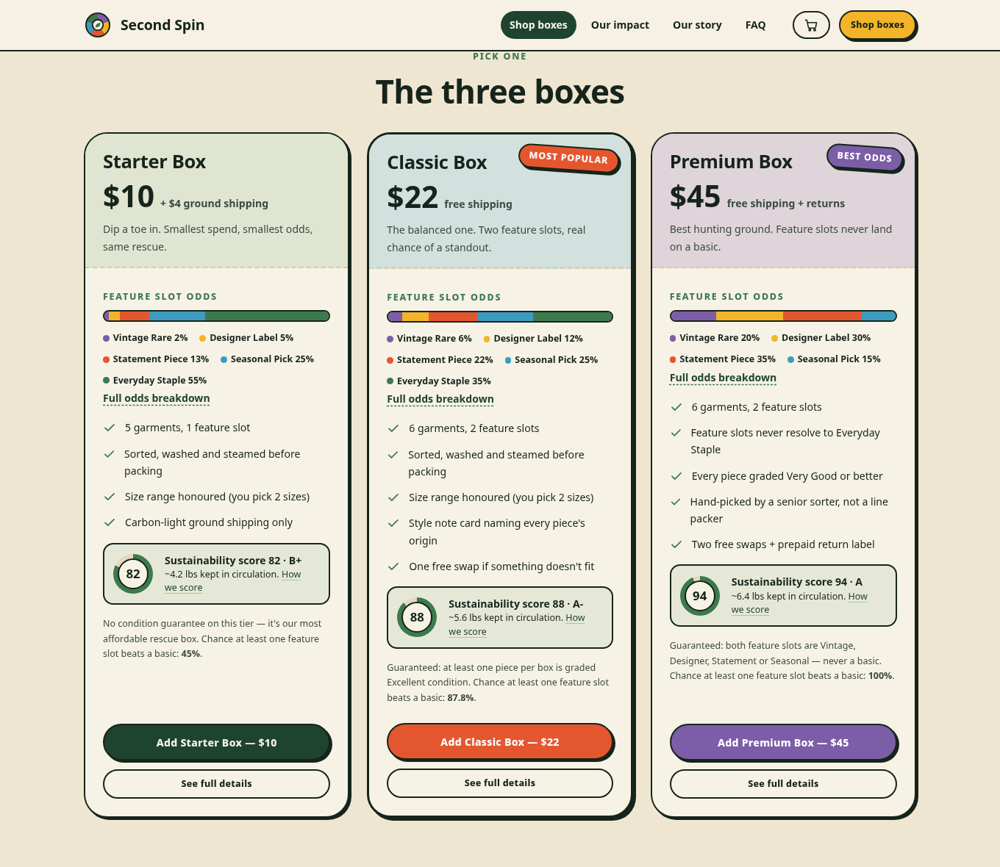

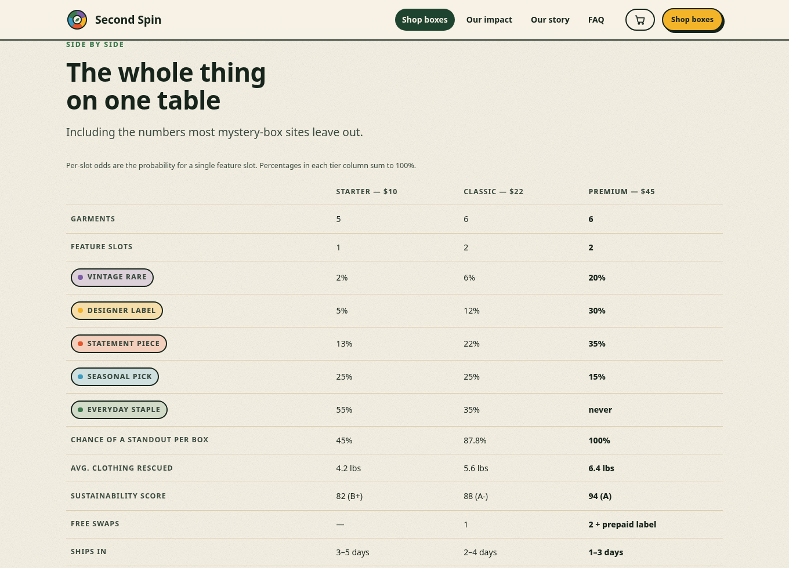

### Impact

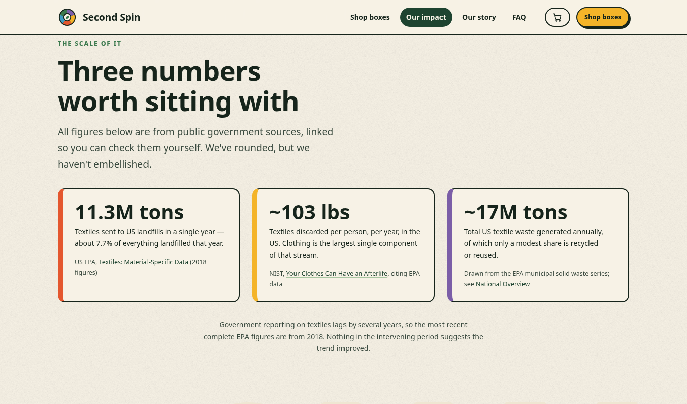

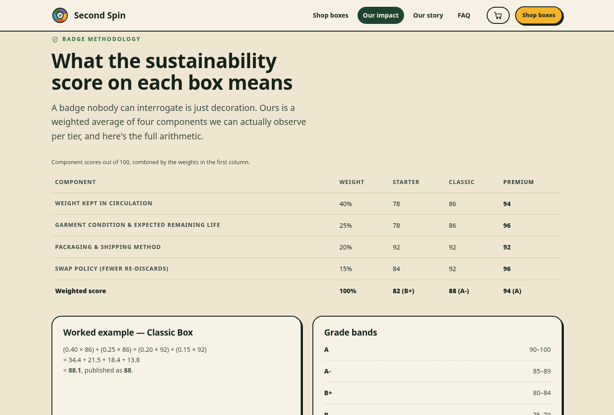

### Others

| | |
|---|---|
| How it works | [`21-how-it-works.png`](docs/screenshots/21-how-it-works.png) |
| Tier teaser | [`22-tier-teaser.png`](docs/screenshots/22-tier-teaser.png) |
| Testimonials | [`24-testimonials.png`](docs/screenshots/24-testimonials.png) |
| Box anatomy | [`33-box-slots.png`](docs/screenshots/33-box-slots.png) |
| Garment journey | [`29-impact-journey.png`](docs/screenshots/29-impact-journey.png) |
| FAQ / odds disclosure | [`31-faq-odds.png`](docs/screenshots/31-faq-odds.png) |
| About timeline | [`32-about-timeline.png`](docs/screenshots/32-about-timeline.png) |
| Mobile homepage | [`11-mobile-home.png`](docs/screenshots/11-mobile-home.png) |
| Mobile nav open | [`13-mobile-nav-open.png`](docs/screenshots/13-mobile-nav-open.png) |
